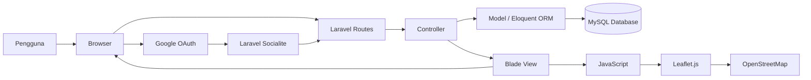
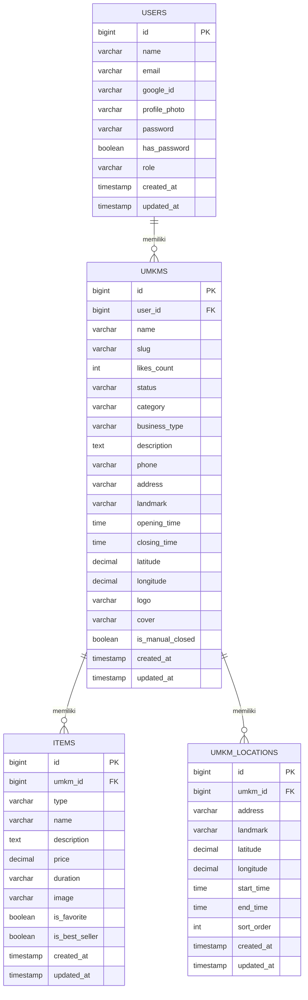

<div align="center">
  
  # UMKMkita 
  ### Temukan UMKM, Dekatkan Pelanggan
  
  [](https://umkmkita-production.up.railway.app/)
  [](https://github.com/FathurrizqiRPL/UMKMKita)
  [](LICENSE)
  
  **Submission for ITECHNO CUP 2026 - Web Development**
  
  **By TerserahKetua**
  
</div>

---

## 📋 Daftar Isi

- [Tentang Proyek](#-tentang-proyek)
- [Fitur Unggulan](#-fitur-unggulan)
- [Demo & Screenshot](#-demo--screenshot)
- [Teknologi](#-teknologi)
- [Arsitektur Sistem](#-arsitektur-sistem)
- [Instalasi & Setup](#-instalasi--setup)
- [Penggunaan](#-penggunaan)
- [API Documentation](#-api-documentation)
- [Testing](#-testing)
- [Tim Developer](#-tim-pengembang)
- [Lisensi](#-lisensi)

---

## 👥 Tim Developer

| Nama | Peran | GitHub |
|------|-------|--------|
| **Fathurrizqi Hidayat** | Full Stack Developer | https://github.com/FathurrizqiRPL |
| **Harun** | Frontend Developer | https://github.com/Runtax-html |
| **Luthfi Daffa Nur Syafaat** | Backend Developer | https://github.com/noerdaffa |


---

## 🎯 Tentang Proyek

### Latar Belakang

UMKM memiliki peran penting dalam perekonomian masyarakat, tetapi tidak semua pelaku UMKM memiliki akses, kemampuan teknis, atau anggaran untuk membangun media promosi digital mereka sendiri.

Di sisi lain, masyarakat sering kali kesulitan menemukan UMKM lokal yang berada di sekitar mereka, terutama usaha kecil yang belum memiliki kehadiran digital yang kuat. Tantangan ini menjadi semakin besar bagi UMKM keliling yang tidak selalu beroperasi pada satu lokasi tetap.

UMKMkita hadir sebagai platform digital yang membantu pelaku UMKM membangun kehadiran online dengan lebih mudah sekaligus membantu masyarakat menemukan UMKM lokal di sekitar mereka.

### Solusi yang Ditawarkan

UMKMkita menyediakan platform yang memungkinkan pemilik UMKM membuat halaman website usahanya tanpa perlu membangun website dari awal.

Setiap UMKM dapat menampilkan informasi usaha, produk atau layanan, lokasi, serta informasi pendukung lainnya. UMKMkita juga menyediakan fitur Radar UMKM untuk membantu pengguna menemukan UMKM di sekitar lokasi mereka.

Platform mendukung dua jenis usaha, yaitu **UMKM Di Tempat** yang memiliki lokasi tetap dan **UMKM Keliling** yang dapat memiliki beberapa titik standby beserta waktu operasionalnya.

- 🎯 **Tujuan Utama**: Membantu UMKM membangun kehadiran digital dan mempermudah masyarakat menemukan usaha lokal.
- 📊 **Target Pengguna**: Pelaku UMKM serta masyarakat yang ingin menemukan produk dan layanan UMKM di sekitarnya.
- 💡 **Value Proposition**: Menggabungkan pembuatan website UMKM dan pencarian UMKM berbasis lokasi dalam satu platform yang mudah digunakan.

---

## ✨ Fitur Unggulan

### Fitur Utama

| Fitur | Deskripsi | Keunggulan |
|----------|--------------|---------------|
| **Website UMKM** | Pemilik UMKM dapat membuat halaman website untuk mempromosikan usaha, produk, dan layanannya. | Membantu UMKM memiliki media promosi digital tanpa harus membuat website dari awal. |
| **Radar UMKM** | Pengguna dapat menemukan UMKM di sekitar lokasi mereka melalui peta interaktif. | Mempermudah masyarakat menemukan dan mengenal usaha lokal di sekitarnya. |
| **UMKM Di Tempat & Keliling** | Platform mendukung usaha dengan lokasi tetap maupun usaha keliling dengan beberapa titik standby. | Lebih fleksibel untuk berbagai model operasional UMKM, termasuk pedagang keliling. |
| **Manajemen Produk & Layanan** | Pemilik UMKM dapat menambahkan dan mengelola produk atau layanan yang ditampilkan pada website mereka. | Informasi usaha dapat diperbarui sendiri melalui dashboard tanpa mengubah kode website. |

### Fitur Tambahan

- **Dashboard UMKM** - Pusat pengelolaan website, informasi usaha, dan produk atau layanan.
- **Pencarian & Filter UMKM** - Membantu pengguna mencari UMKM berdasarkan nama maupun kategori.
- **Lokasi & Jam Operasional** - Menampilkan informasi lokasi dan waktu operasional UMKM.
- **Panel Admin** - Admin dapat memantau pengguna dan UMKM serta mengatur status UMKM.
- **Responsive Design** - Antarmuka dirancang agar dapat digunakan pada desktop maupun perangkat mobile.
- **Google Authentication** - Pengguna dapat masuk menggunakan akun Google. Jika email Google sudah terdaftar secara manual, akun Google akan ditautkan ke akun yang sama tanpa membuat akun duplikat. Akun yang pertama kali dibuat melalui Google tidak memiliki password manual (`has_password = false`), sehingga form perubahan password tidak ditampilkan. Akun yang sebelumnya dibuat secara manual tetap dapat menggunakan password meskipun kemudian ditautkan dengan akun Google.

---

## 📸 Demo & Screenshot

### Live Demo

🔗 **Kunjungi Website : https://umkmkita-production.up.railway.app/**

### Screenshot Aplikasi

<div align="center">
  
  <p><em>form login</em></p>
  

  
  <p><em>form registrasi</em></p>
  
  
  
  <p><em>Homepage - Tampilan utama aplikasi</em></p>
  

  
  <p><em>Homepage - Tampilan Cara Kerja Aplikasi</em></p> 
  

  
  <p><em>Homepage - Tampilan Jelajahi UMKM</em></p>
  

  
  

  
  <p><em>Homepage - Tampilan Tentang Aplikasi</em></p>
  

  
  <p><em>Homepage - Footer</em></p>
  


  
  <p><em>Dashboard - Pemilik UMKM</em></p>

  
  <p><em>Edit Website - Pemilik UMKM</em></p>

  
    <p><em>Lihat Website - Pemilik UMKM</em></p>
  


  
  <p><em>Radar UMKM - Tampilan Radar UMKM</em></p>
  
  
  <p><em>[Nama Fitur] - [Deskripsi screenshot]</em></p>
</div>

### Video Demo

📹 **[Link Video Demo](https://[URL_VIDEO])** _(opsional)_

---

<a id="-teknologi"></a>
## 🛠️ Teknologi

### Tech Stack

#### Frontend
```text
Template Engine : Blade
Styling         : CSS3
Scripting       : JavaScript
Map Library     : Leaflet.js
Map Data        : OpenStreetMap
```

#### Backend
```text
Runtime         : PHP 8.3+
Framework       : Laravel
ORM             : Eloquent ORM
Authentication  : Laravel Breeze + Laravel Socialite (Google OAuth)
Database        : MySQL
```

#### DevOps & Tools
```text
Package Manager : Composer, npm
Build Tool      : Vite
Version Control : Git & GitHub
Deployment      : Railway
Testing         : PHPUnit
```
### Alasan Pemilihan Teknologi

| Teknologi | Alasan Pemilihan |
|-----------|------------------|
| **Laravel** | Dipilih sebagai framework utama karena menyediakan struktur MVC serta fitur seperti routing, validation, authentication, dan Eloquent ORM yang membantu pengembangan aplikasi menjadi lebih terstruktur. |
| **Blade** | Terintegrasi langsung dengan Laravel dan memudahkan pembuatan halaman dinamis tanpa membutuhkan framework frontend tambahan. |
| **JavaScript** | Digunakan untuk menangani interaksi dinamis pada sisi pengguna, seperti pengelolaan lokasi, interaksi Radar UMKM, dan berbagai fitur antarmuka lainnya. |
| **MySQL** | Digunakan sebagai sistem manajemen database untuk menyimpan dan mengelola data pengguna, UMKM, produk atau layanan, lokasi, serta data aplikasi lainnya secara terstruktur. |
| **Leaflet.js** | Digunakan untuk membangun peta interaktif pada fitur Radar UMKM karena ringan, fleksibel, dan mudah diintegrasikan dengan OpenStreetMap. |
| **OpenStreetMap** | Digunakan sebagai sumber data peta untuk menampilkan lokasi UMKM pada fitur berbasis lokasi. |
| **Railway** | Digunakan sebagai platform deployment agar UMKMkita dapat dijalankan dan diakses secara online. |

### Dependencies Utama

#### Composer
```json
{
  "php": "^8.3",
  "laravel/framework": "^13.8",
  "laravel/tinker": "^3.0",
  "laravel/socialite": "^5.31",
  "laravel/breeze": "^2.4",
  "phpunit/phpunit": "^12.5.12"
}
```

#### NPM
```json
{
  "laravel-vite-plugin": "^3.1",
  "vite": "^8.0.0"
}
```

---

<a id="-arsitektur-sistem"></a>
## 🏗️ Arsitektur Sistem

### System Architecture

UMKMkita menggunakan arsitektur **Model-View-Controller (MVC)** yang disediakan oleh Laravel. Arsitektur ini memisahkan tampilan, logika aplikasi, dan pengelolaan data agar pengembangan lebih terstruktur dan mudah dikelola.



### Database Schema

Berikut merupakan Entity Relationship Diagram (ERD) dari database UMKMkita:



### Folder Structure

```text
UMKMKita/
├── app/
│   ├── Http/
│   │   ├── Controllers/     # Logika aplikasi
│   │   └── Middleware/      # Middleware aplikasi
│   ├── Models/              # Model Eloquent
│   └── Providers/           # Service provider
│
├── bootstrap/               # Proses bootstrap Laravel
├── config/                  # Konfigurasi aplikasi
│
├── database/
│   ├── factories/           # Model factory
│   ├── migrations/          # Struktur database
│   └── seeders/             # Data seeder
│
├── public/
│   ├── css/                 # Stylesheet aplikasi
│   ├── js/                  # JavaScript aplikasi
│   └── images/              # Asset gambar
│
├── resources/
│   └── views/               # Blade template
│
├── routes/
│   ├── web.php              # Route utama aplikasi
│   └── auth.php             # Route autentikasi
│
├── tests/                   # Direktori testing Laravel
├── composer.json            # Dependency PHP
├── package.json             # Dependency frontend
├── vite.config.js           # Konfigurasi Vite
└── artisan                  # Laravel CLI
```
---

<a id="-instalasi--setup"></a>
## ⚙️ Instalasi & Setup

### Prerequisites

Pastikan Anda telah menginstall:

- **PHP 8.3 atau lebih tinggi**
- **Composer**
- **Node.js 22.12 atau lebih tinggi**
- **npm**
- **MySQL**
- **Git**

### Langkah Instalasi

#### 1️⃣ Clone Repository

```bash
git clone https://github.com/FathurrizqiRPL/UMKMKita.git
cd UMKMKita
```

#### 2️⃣ Install Dependencies

Install dependency PHP menggunakan Composer:

```bash
composer install
```

Install dependency frontend menggunakan npm:

```bash
npm install
```

#### 3️⃣ Setup Environment Variables

Salin file `.env.example` menjadi `.env`:

```bash
cp .env.example .env
```

Kemudian generate application key Laravel:

```bash
php artisan key:generate
```

#### 4️⃣ Setup Database MySQL

Buat database MySQL baru, misalnya:

```sql
CREATE DATABASE umkmkita;
```

Kemudian sesuaikan konfigurasi database pada file `.env`:

```env
DB_CONNECTION=mysql
DB_HOST=127.0.0.1
DB_PORT=3306
DB_DATABASE=umkmkita
DB_USERNAME=root
DB_PASSWORD=
```

> Sesuaikan `DB_USERNAME` dan `DB_PASSWORD` dengan konfigurasi MySQL pada perangkat Anda.

#### 5️⃣ Setup Google OAuth

UMKMkita mendukung autentikasi menggunakan akun Google melalui **Laravel Socialite** dan **Google OAuth 2.0**.

Untuk mengaktifkan fitur login dengan Google:

1. Buka [Google Auth Platform](https://console.cloud.google.com/auth/clients).
2. Buat atau pilih project Google Cloud.
3. Konfigurasikan **Google Auth Platform** untuk aplikasi.
4. Buat **OAuth Client ID** dengan tipe aplikasi **Web application**.
5. Tambahkan **Authorized Redirect URI** untuk development:

```text
http://127.0.0.1:8000/auth/google/callback
```

6. Setelah OAuth Client berhasil dibuat, Google akan memberikan **Client ID** dan **Client Secret**. Salin credential tersebut ke file `.env`:

```env
GOOGLE_CLIENT_ID=your_google_client_id
GOOGLE_CLIENT_SECRET=your_google_client_secret
GOOGLE_REDIRECT_URI="${APP_URL}/auth/google/callback"
```

Ganti `your_google_client_id` dan `your_google_client_secret` dengan credential yang diperoleh dari Google Auth Platform.

Untuk deployment, tambahkan juga callback sesuai domain aplikasi sebagai **Authorized Redirect URI**:

```text
https://your-domain.com/auth/google/callback
```

Kemudian simpan `GOOGLE_CLIENT_ID` dan `GOOGLE_CLIENT_SECRET` sebagai environment variables pada platform deployment.

Dokumentasi resmi:
- [Laravel Socialite](https://laravel.com/docs/socialite)
- [Google OAuth 2.0](https://developers.google.com/identity/protocols/oauth2)


```
#### 6️⃣ Jalankan Migration & Seeder

Jalankan migration dan seeder untuk membuat struktur database sekaligus menyiapkan akun Admin Localhost:

```bash
php artisan migrate --seed
```

Akun Admin Localhost:

```text
Email    : admin@localhost.test
Password : Admin12345
```

> Admin Localhost digunakan untuk kebutuhan development dan pengujian project secara lokal. Admin Hosting menggunakan akun yang berbeda.

#### 7️⃣ Buat Storage Link

Buat symbolic link agar file yang tersimpan pada storage dapat diakses melalui aplikasi:

```bash
php artisan storage:link
```

#### 8️⃣ Jalankan Aplikasi

Jalankan Laravel development server:

```bash
php artisan serve
```

Pada terminal terpisah, jalankan Vite:

```bash
npm run dev
```

Aplikasi secara default dapat diakses melalui:

```text
http://127.0.0.1:8000
```


---

## 🚀 Penggunaan

### Menjalankan Aplikasi

Jalankan Laravel development server:

```bash
php artisan serve
```

Pada terminal terpisah, jalankan Vite:

```bash
npm run dev
```

Aplikasi secara default dapat diakses melalui:

```text
http://127.0.0.1:8000
```

### User Guide

#### Untuk Pengguna Umum

1. **Jelajahi UMKM**: Pengguna dapat melihat berbagai UMKM yang tersedia melalui halaman utama.
2. **Cari UMKM**: Gunakan fitur pencarian dan kategori untuk menemukan UMKM sesuai kebutuhan.
3. **Radar UMKM**: Gunakan Radar UMKM untuk menemukan UMKM yang berada di sekitar lokasi pengguna.
4. **Lihat Detail UMKM**: Pilih UMKM untuk melihat informasi usaha, produk atau layanan, lokasi, dan informasi lainnya.

#### Untuk Pemilik UMKM

1. **Registrasi/Login**: Buat akun menggunakan email dan password atau masuk menggunakan akun Google. Jika email Google sudah pernah terdaftar secara manual, sistem menggunakan akun yang sama tanpa membuat akun duplikat.
2. **Buat Website UMKM**: Lengkapi informasi usaha untuk membuat halaman website UMKM.
3. **Tentukan Jenis Usaha**: Pilih jenis usaha **Di Tempat** untuk UMKM dengan lokasi tetap atau **Keliling** untuk UMKM dengan beberapa titik standby.
4. **Kelola Produk/Layanan**: Tambahkan dan kelola produk atau layanan yang akan ditampilkan pada website UMKM.
5. **Kelola Informasi UMKM**: Perbarui profil, lokasi, jam operasional, dan informasi usaha melalui dashboard.
6. **Bagikan Website**: Gunakan alamat website UMKM yang tersedia pada dashboard untuk membagikan halaman usaha kepada pelanggan.

#### Untuk Admin

1. **Login Admin**: Masuk menggunakan akun yang memiliki akses administrator.
2. **Kelola UMKM**: Pantau dan kelola data UMKM yang terdaftar pada platform.
3. **Kelola Pengguna**: Pantau data pengguna yang terdaftar pada UMKMkita.
4. **Kelola Status UMKM**: Atur status UMKM sesuai kebutuhan pengelolaan platform.

---

## 📚 API Documentation

UMKMkita saat ini tidak menyediakan **REST API atau public API** secara khusus. Aplikasi dibangun menggunakan Laravel dengan pendekatan server-side rendering melalui Blade.

Pada fitur **Radar UMKM**, aplikasi memanfaatkan layanan eksternal untuk mendukung fitur berbasis lokasi:

- **OpenStreetMap** sebagai sumber peta.
- **Nominatim** untuk pencarian dan geocoding lokasi.
- **Leaflet.js** sebagai library untuk menampilkan dan mengelola interaksi peta pada sisi frontend.

---

## 🧪 Testing

Pengujian UMKMkita dilakukan menggunakan kombinasi **manual testing** dan **automated testing** untuk membantu memastikan aplikasi dapat berjalan dengan baik selama proses pengembangan.

### Manual Testing

Pengujian manual dilakukan melalui development server Laravel:

```text
http://127.0.0.1:8000
```

Pengujian dilakukan dengan mencoba langsung berbagai alur dan fitur aplikasi, seperti autentikasi email/password, login Google OAuth, pembuatan akun melalui Google, penautan akun Google dengan akun manual yang memiliki email sama, pengelolaan data UMKM, pengelolaan produk atau layanan, Radar UMKM, serta tampilan website UMKM.

### Automated Testing

Project juga menyediakan pengujian melalui Laravel Test Runner yang dapat dijalankan dengan:

```bash
php artisan test
```

Automated testing pada project menggunakan **PHPUnit** sebagai testing framework.

> Cakupan automated testing masih terbatas dan pengujian utama terhadap keseluruhan fitur aplikasi tetap dilakukan secara manual selama proses pengembangan.
---

## 📄 Lisensi

Proyek ini dilisensikan di bawah [MIT License](LICENSE) - lihat file LICENSE untuk detail lebih lanjut.

---

<div align="center">

  **Made with ❤️ by Terserah Ketua for ITECHNO CUP 2026**

  
</div>
